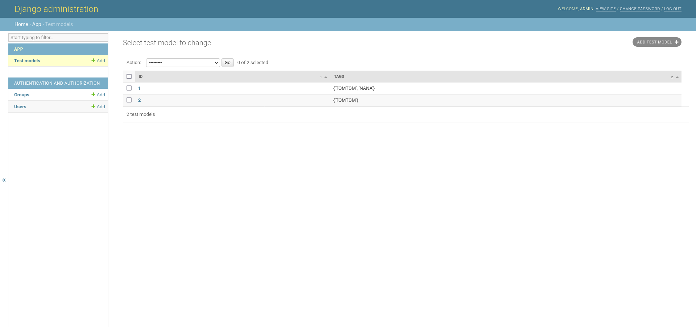
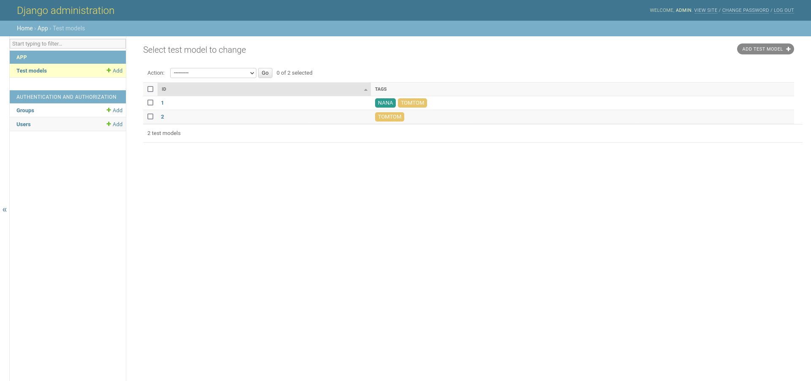
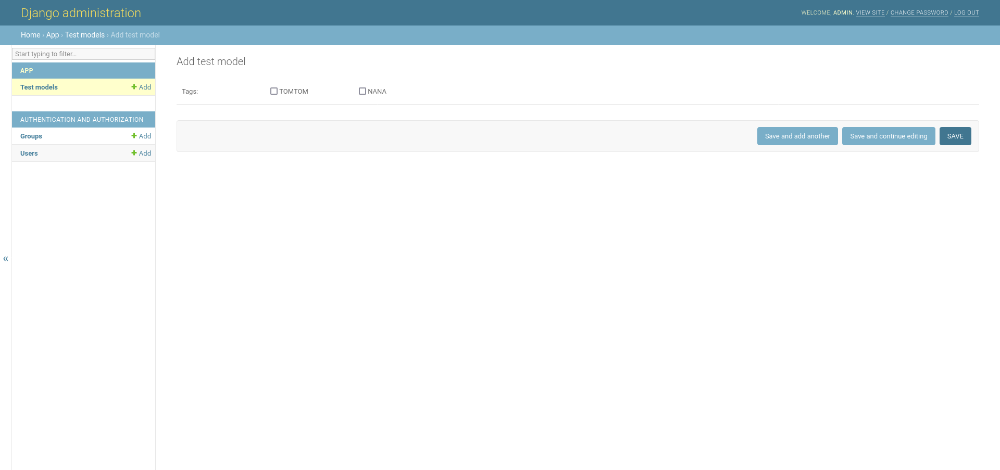

# django-setfield
Django model field to handle sets (in the python/math sense)

## Get started

```python
from django.db import models
from django_set_field.fields import SetField


class TestModel(models.Model):
    CHOICES = ["TOMTOM", "NANA"]

    tags = SetField(choices=CHOICES)
```

Now you can manipulate the field like a python set

```python
m = TestModel()
m.tags.add("TOMTOM")
m.save()
```

The default value for the `SetField` is the empty set (you do not have to declare it) but you can define a different one.

```python
class TestModel(models.Model):
    CHOICES = ["TOMTOM", "NANA"]

    tags = SetField(choices=CHOICES, default={"NANA"})
```

:warning: The parameter `choices` does not create a constraint on the DB side (see [Internals](#internals)). It means that you can change it without migration but the **previous stored values will lose their meaning**.
The *good* practice is obviously not to modify it but if you really need to add new choices, you must append them to the list.

## Admin

Models with `SetField` can be registered in the admin panel.

```python
from django.contrib import admin

from app.models import TestModel

class TestModelAdmin(admin.ModelAdmin):
    list_display = ["id", "tags"]

admin.site.register(TestModel, TestModelAdmin)
```

The `SetField` is currently "displayable" as a raw string.



You can modify this behaviour by referencing a method in the admin model
```python
class TestModelAdmin(admin.ModelAdmin):
    list_display = ["id", "get_tags"]

    def get_tags(self, obj: TestModel) -> str:
        return "+".join(sorted(obj.tags))
    
    get_tags.short_description = "tags"
```
You can even provide a fancier result by returning html

```python
from django.utils.safestring import mark_safe

def to_css(d: dict):
    return ";".join([f"{k}: {v}" for k, v in d.items()])


class TestModelAdmin(admin.ModelAdmin):
    list_display = ["id", "get_tags"]

    def get_tags(self, obj: TestModel) -> str:
        base_style = {
            "margin": "0 0.2em",
            "padding": "0.2em 0.5em",
            "border-radius": "5px",
            "color": "white",
        }
        style = {
            "TOMTOM": base_style | {"background-color": "#e9c46a"},
            "NANA": base_style | {"background-color": "#2a9d8f"},
        }
        spans = [
            f"""<span style="{to_css(style[tag])}">{tag}</span>"""
            for tag in sorted(obj.tags)
        ]
        return mark_safe("".join(spans))

    get_tags.short_description = "tags"
```



Currently the `list_filter` option is not supported (empty filter in the panel). In practice, we may imagine to filter results that have a certain element in the `SetField` (a certain tag in our example). But the default admin list filter performs an [`__exact` lookup](https://docs.djangoproject.com/en/4.1/ref/models/querysets/#exact). So the filter keeps only the records that exactly have a set with the selected element. Ideally, the filter should perform a [`__contains` lookup](https://docs.djangoproject.com/en/4.1/ref/models/querysets/#std-fieldlookup-contains).

In the creation form, a multi-checkbox widget is used to select among the available choices.




## DRF

[DRF](https://www.django-rest-framework.org/) supports `SetField` through the `MultipleChoiceField` (but currently you must to pass the choices manually)

```python
from rest_framework import serializers

from .models import TestModel

class TestSerializer(serializers.ModelSerializer):
    tags = serializers.MultipleChoiceField(choices=TestModel.CHOICES)
    
    class Meta:
        model = TestModel
        fields = ["tags"]
        read_only_fields = ["id"]
```

## Internals

The strategy to implement such a field is merely to use the bits of an integer. Thus, a `SetField` is a `PositiveBigIntegerField`. As an example, with `choices=["TOMTOM", "NANA"]` we have

| Set                  | Binary | Integer |
| -------------------- | ------ | ------- |
| `{}`                 | `0b00` | `0`     |
| `{"TOMTOM"}`         | `0b01` | `1`     |
| `{"NANA"}`           | `0b10` | `2`     |
| `{"TOMTOM", "NANA"}` | `0b11` | `3`     |

The order of the choices is then very important to keep your logic coherent. You should not change it if some records are stored in DB.